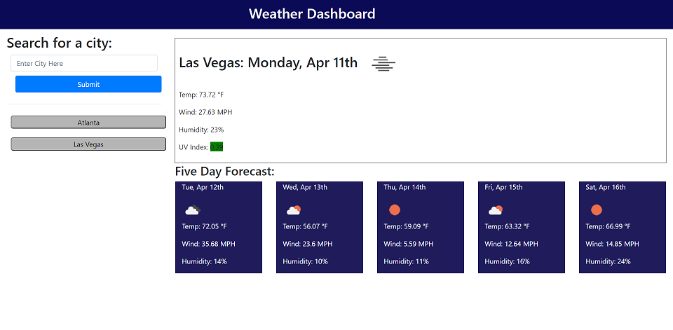

# Weather Dashboard

## Description

This Weather Dashboard application allows the user to enter a city and returns the current weather forecast, as well as a future five day forecast.

The application also saves the city searches to local storage and then displays them to be able to be clicked on again.

## Table of Contents

- [Screenshots and Links](#screenshots)
- [Acceptance Criteria](#acceptance)
- [What I Learned](#learned)

## ScreenShots

Below is a screen shot of the web application:

The page is live on [GitHub Pages](https://stephencurrie.github.io/hw-6-weather-dashboard/)

The code is in the [GitHub Repository](https://github.com/stephencurrie/hw-6-weather-dashboard)

## Acceptance

The following were the acceptance criteria for the ticket:

- [x] When I search for a city, I am presented with current and future conditions for that city
- [x] When I view the current conditions for that city, I am presented with the city name, the date, an icon representing the weather conditions, the temperature, the humidity, the wind speed, and the UV index
- [x] When I view the UV index, I am presented a color that indicates if the conditions are favorable, moderate or severe
- [x] When I view the future weather conditions for a city, I am presented with a 5-day forecast that displays the date, an icon representing the weather conditions, the temperature, the wind speed and the humidity
- [x] When I click on a city in the search history, I am again presented with the current and future conditions for that city

## Learned

The following is a list of things I learned:

- How to make multiple calls to a server side API
- How to read the api documentation to determine the best way to get the data and how to interpret what is returned
- How to parse the data that is returned and store it as a variable
- How to display the data that is returned from a server API and display it on a web page
- How to dynamically generate HTML elements with the document.createElement code in javascript
- How to read and write data to local storage
